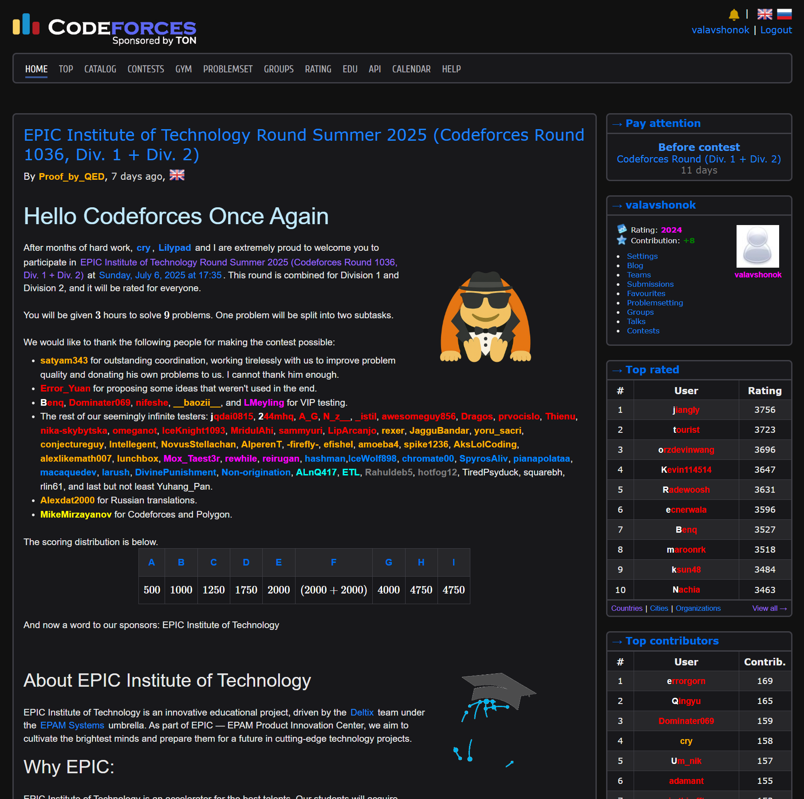
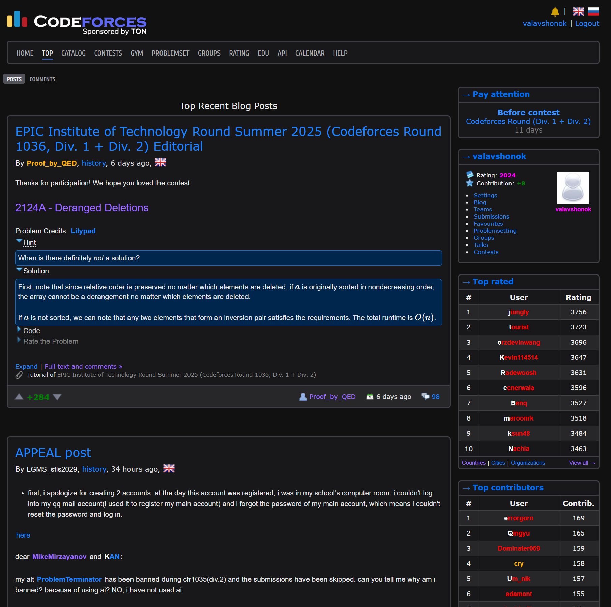
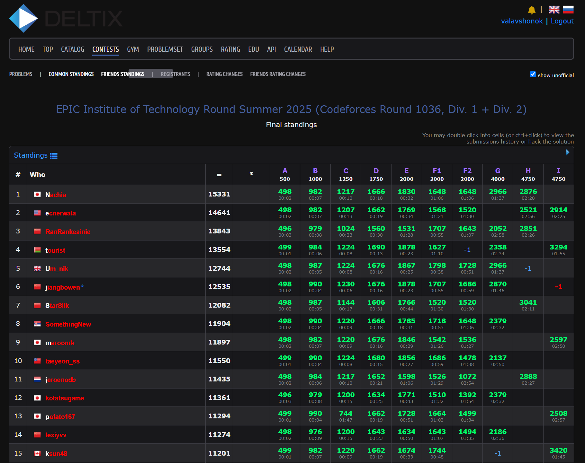
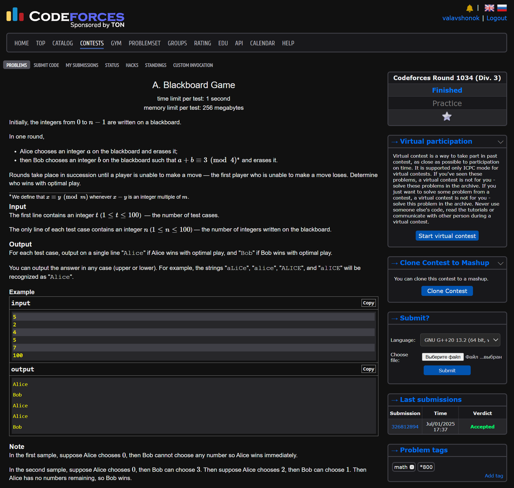
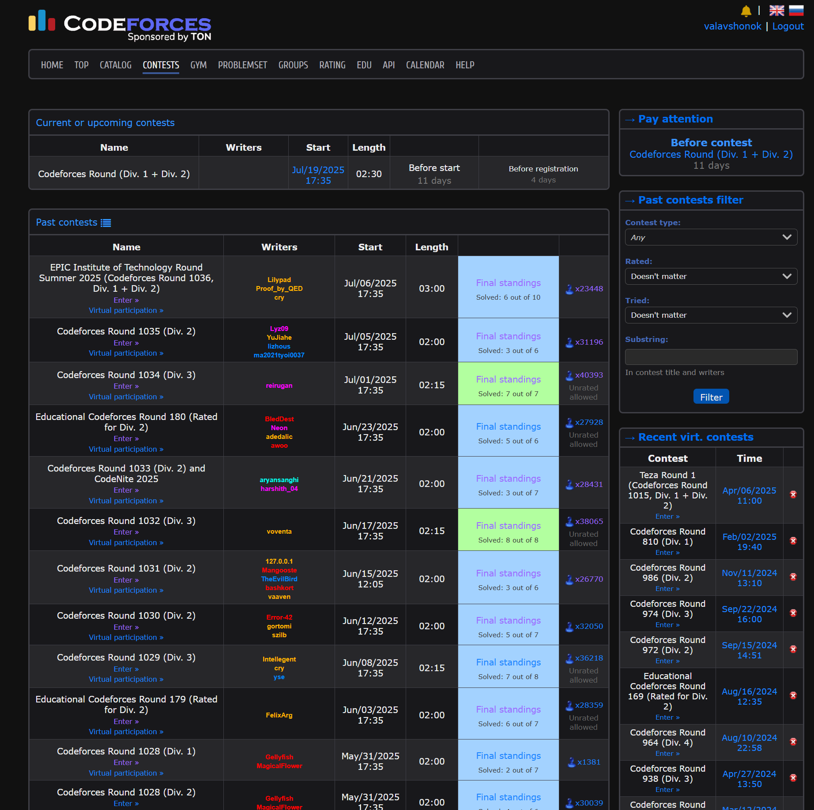
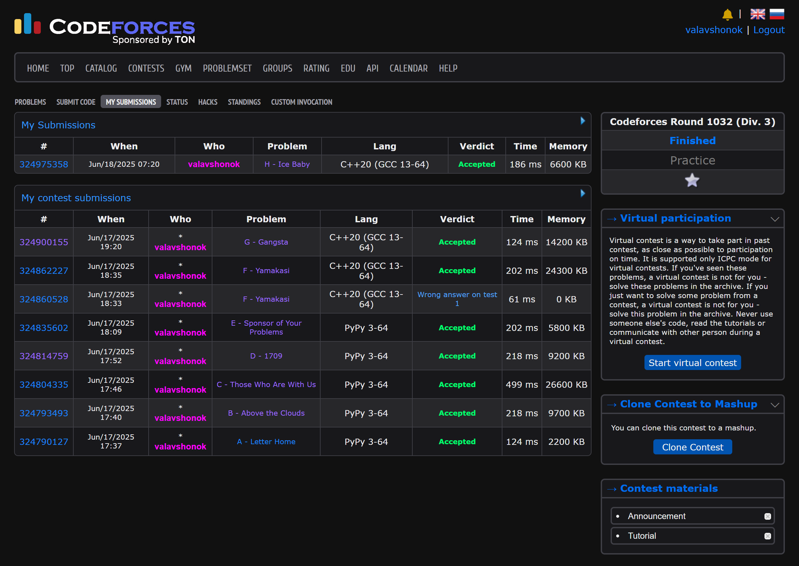

# 🌓 Codeforces Dark Mode

Cool dark theme for [Codeforces](http://codeforces.com/).  
This extension includes a dark mode for more comfortable work on the site.

---

## 📦 Installation

1. Download the repository as a ZIP or clone it:
   ```bash
   git clone https://github.com/valavshonok/cf-dark-mode.git
   ```
2. Open the page [chrome://extensions](chrome://extensions/) in the Chrome browser (or a similar one for your browser).
3. Turn on **«developer mode»** (in the upper-right corner).
4. Click **«Download the unpacked extension»** and select the folder with the extension.

---

## 🧙 Opportunities

- 🌙 Beautiful dark theme for Codeforces
- 🎯 There are no delays or screen flickers when refreshing pages
- ⚡ Easy and fast
- 🔒 Without data collection — works completely locally

---

## 🖼️ Screenshots













